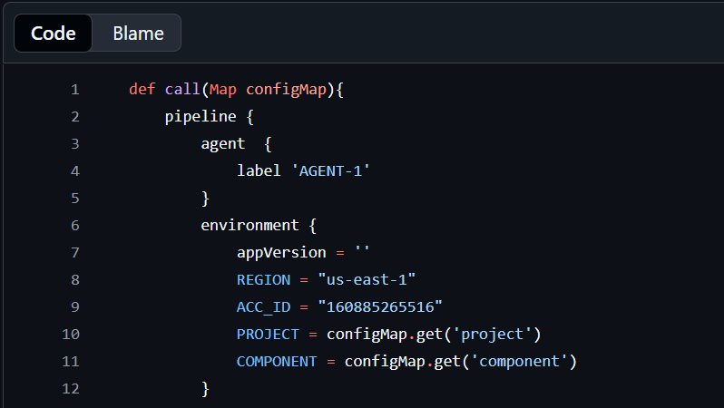
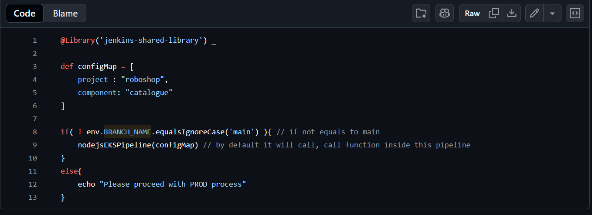

## this repo will have the Jenkins shared library related files for different programing languages

## Understanding Jenkinsfile and its corresponding Jenkins-shared-library structures

    - mana repo lo unde jenkinsfile poi jenkins-shared-library ni call chesthadi i.e., manam oka function ni call chesthunnam
    - mana repo lo unde jenkinsfile evaithe variables ni use chesthunnamo liike project, component etc... avve variables ni jenkins-shared-library lo env variables laga declare cheyali...so that avvi match aina tharvatha jenkins-shared-library will be triggered from our jenkinsfile

    - from the above image we can understand that line nos 10 and 11 are being called from the jenkinsfile which is in our repo as shown in the below image

    - And manam declare chese variables(in jenkins-shared-library) should be same as the values in in our Jenkinsfile

    - In the below image, line nos 8 and 9 indicates that if the branch name is not equal to main, it will trigger the respective NodeJSPipeline(shared-library) otherwise we have to follow the CHANGE REQUEST process for a production release.

  

## Integrating jenkins-shared-library in our Jenkins

